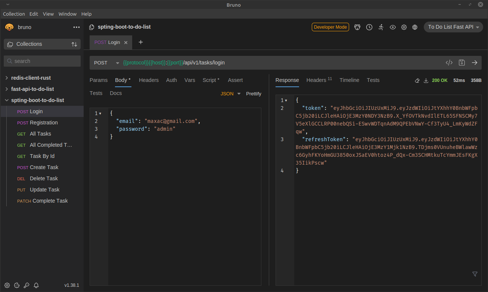

# To Do List Spring Boot

## Postman Collection



## Run Docker Postgres

```bash
docker run -d \
    -e POSTGRES_USER=postgres \
    -e POSTGRES_PASSWORD=admin \
    -e POSTGRES_DB=postgres \
    -p 5432:5432 \
    --name postgres \
    postgres
```

## Что нужно будет добавить в проект

1. Роли (ROLE_ADMIN, ROLE_USER);
2. Мониторинг приложения (Micrometer);
3. Docker-Compose.yml файл;
4. Добавить в Task кто создал задачу;
5. Написать API тесты и UI тесты;
6. Allure отчёт.